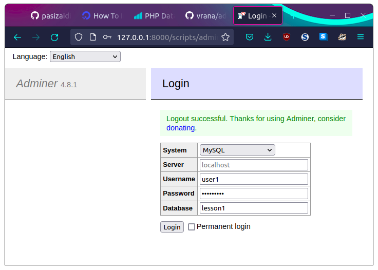
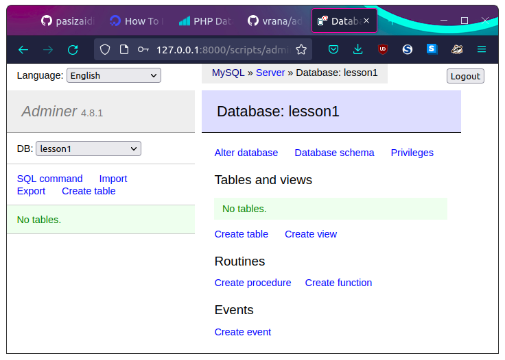

# Ubuntu/Kubuntu MariaDB instaliacija

## MariaDB instaliacija

```
sudo apt update && sudo apt upgrade && sudo apt install mariadb-server mariadb-client
```

## sudo mysql_secure_installation

Nedekit jokio root slaptazodzio nes tai bloga praktika, bus naudojamas unix socketas root authetikacijai, o siaip bus naudojamas paprastas non-root useris

```
sudo mysql_secure_installation
```

```

NOTE: RUNNING ALL PARTS OF THIS SCRIPT IS RECOMMENDED FOR ALL MariaDB
      SERVERS IN PRODUCTION USE!  PLEASE READ EACH STEP CAREFULLY!

In order to log into MariaDB to secure it, we'll need the current
password for the root user.  If you've just installed MariaDB, and
you haven't set the root password yet, the password will be blank,
so you should just press enter here.

Enter current password for root (enter for none): 

```

```

. . .
OK, successfully used password, moving on...

Setting the root password ensures that nobody can log into the MariaDB
root user without the proper authorisation.

Set root password? [Y/n] N

```


## Duomenu bazes susikurimas

```

$ sudo mysql
[sudo] password for kentauras: 
Welcome to the MariaDB monitor.  Commands end with ; or \g.
Your MariaDB connection id is 42
Server version: 10.3.32-MariaDB-0ubuntu0.20.04.1 Ubuntu 20.04

Copyright (c) 2000, 2018, Oracle, MariaDB Corporation Ab and others.

Type 'help;' or '\h' for help. Type '\c' to clear the current input statement.

MariaDB [(none)]> CREATE DATABASE lesson1;
Query OK, 1 row affected (0.002 sec)

MariaDB [(none)]> SHOW DATABASES;
+--------------------+
| Database           |
+--------------------+
| dolibarr           |
| information_schema |
| lesson1            |
| mysql              |
| performance_schema |
+--------------------+
5 rows in set (0.002 sec)

MariaDB [(none)]> CREATE USER 'user1'@localhost IDENTIFIED BY 'password1';
Query OK, 0 rows affected (0.003 sec)

MariaDB [(none)]> SELECT User FROM mysql.user;
+----------+
| User     |
+----------+
| dolibarr |
| root     |
| user1    |
+----------+
3 rows in set (0.000 sec)

MariaDB [(none)]> GRANT ALL PRIVILEGES ON lesson1.* TO 'user1'@localhost;
Query OK, 0 rows affected (0.002 sec)

MariaDB [(none)]> FLUSH PRIVILEGES;
Query OK, 0 rows affected (0.001 sec)

MariaDB [(none)]> SHOW GRANTS FOR 'user1'@localhost;
+--------------------------------------------------------------------------------------------------------------+
| Grants for user1@localhost                                                                                   |
+--------------------------------------------------------------------------------------------------------------+
| GRANT USAGE ON *.* TO `user1`@`localhost` IDENTIFIED BY PASSWORD '*668425423DB5193AF921380129F465A6425216D0' |
| GRANT ALL PRIVILEGES ON `lesson1`.* TO `user1`@`localhost`                                                   |
+--------------------------------------------------------------------------------------------------------------+
2 rows in set (0.000 sec)
```

## Prisijungimas naudojant adminer.php

1. Suvedam



2. Prisijungta


