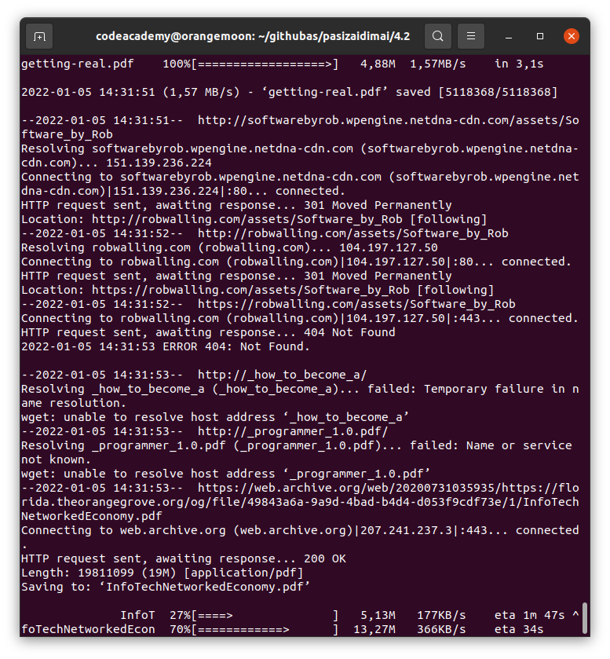

# Bazinis skrapinimas naudojant shelline narsykle
modifikuotas nemokamu pdf knygu parsisiuntimui is github

## Skriptui reikalingi unix-like irankiai
- lynx

- wget

- grep

### ubuntu/debian pasirengimas ir paleidimas per terminala

toolsu isirasymas

    /usr/bin/sudo /usr/bin/apt update && /usr/bin/sudo /usr/bin/apt install -y lynx wget grep

skripto parsisiuntimas

    /usr/bin/wget https://raw.githubusercontent.com/shinbeth/pasizaidimai/master/4.2/get_files_from_web.sh

skripto padarymas executable
    
    /usr/bin/chmod +x get_files_from_web.sh

skripto paleidimas    
    
    ./get_files_from_web.sh

### Windowsu naudotojams (uzjauciu) reikalingas
https://www.cygwin.com/

### mac, kainuoja pakankamai, kad apple teiktu supporta
