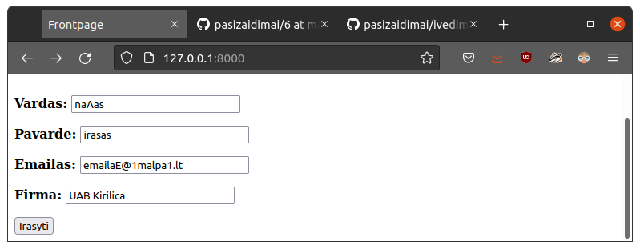
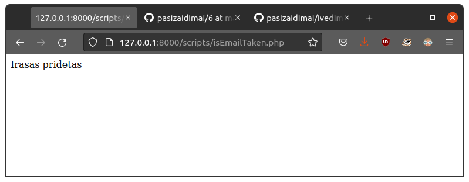
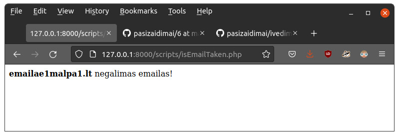
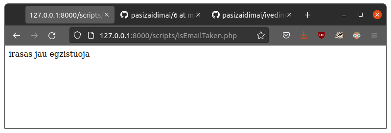
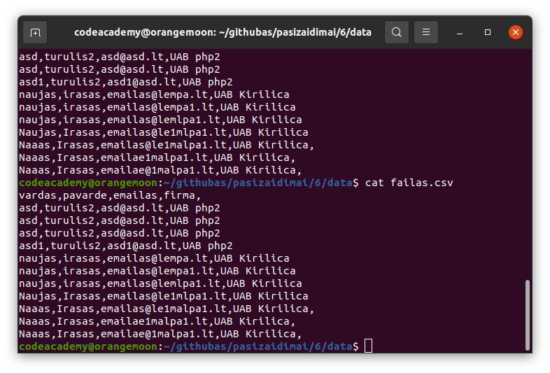

# naujo iraso pridejimas i CSV

## Padaryta

### Ivedimas

Tiesiog bukai pridedama nauja eilute, emaila naudojant kaip identifikatoriu ir pridedant irasa jei toks emailas dar neegzistuoja. Todel komputaciniu poziuriu panaudoti panasus dalykai, su tuo ka nagrinejame paskaitoje.

### Irasas pridetas

### Negalimas emailas

### Irasas egzistuoja

### Rezultato turinio pvz

Vardu ir pavardziu pirmos raides upper casinimas irasant ir emailo lowercasinimas su kokio nors regexpo panaudojimu jo validumui tikrinti.

## Nepadaryta

Galbut reiketu firmos pavadinima deti i kabutes.

