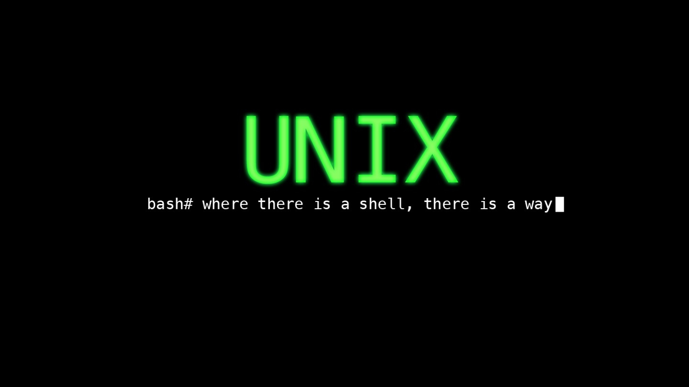

# Pamokos

[Kaip tapti Hakeriu](https://rtfb.lt/hacker-howto-lt.html)

[How to ask questions Smart way](http://catb.org/%7Eesr/faqs/smart-questions.html)

Uzrasus dokumentuoju del saves. Mano metodai 100% pravers tik tiems kas naudoja linux ir tai ubuntu/debian paremtas distribucijas. Kitiems sie uzrasai bus maziau naudingi, ypac windows naudotojams. Taciau paties PHP kodo fragmentai pritaikomi betkokioje operacineje sistemoje.

## Uzrasai

### 1 Pamoka

  
Daugiau

1. [Pamoka](https://github.com/shinbeth/pasizaidimai/tree/master/1) - bazines php sintakses aptarimas
    

    
---

### 2 Pamoka

  
Daugiau

2. [Pamoka](https://github.com/shinbeth/pasizaidimai/tree/master/2) - bazinis php kombinavimas su html
    - [2.1 Saviveikla](https://github.com/shinbeth/pasizaidimai/tree/master/2.1) - CSV failo skaitymas.
    - [2.9 Saviveikla](https://github.com/shinbeth/pasizaidimai/tree/master/2.9) - CSV failo skaitymas
    

    
    
----

### 3 Pamoka

  
Daugiau

3. [Pamoka](https://github.com/shinbeth/pasizaidimai/tree/master/3) - ??? Na cia githubo pasijungimo loopas buvo
    

    
    
----

### 4 Pamoka

  
Daugiau

4. [Pamoka](https://github.com/shinbeth/pasizaidimai/tree/master/4)
    - [4.1 Saviveikla](https://github.com/shinbeth/pasizaidimai/tree/master/4.1) - Bazinis unix-like scrappinimas, OpenBSD dainu parsiuntimo skriptas.(su instrukcijom). Skripto parsiusti failai [cia](https://github.com/shinbeth/pasizaidimai/tree/master/4.1/files)
    - [4.2 Saviveikla](https://github.com/shinbeth/pasizaidimai/tree/master/4.2) - Bazininis unix-like scrappinimas, programavimo knygu parsiuntimas is github. (su instrukcijom). Skripto parsiusti failai [cia](https://github.com/shinbeth/pasizaidimai/tree/master/4.2/files)
    

    
    
----

### 5 Pamoka

  
Daugiau

5. [Pamoka](https://github.com/shinbeth/pasizaidimai/tree/master/5) - Forms - Apendinimas i CSV, aritmetika.
    - [5.1 Saviveikla](https://github.com/shinbeth/pasizaidimai/tree/master/5.1) - PHP skripto panaudojimas, CSV duomenu spausdinimui i stilizuota HTML dokumenta.
    

    
    
----

### 6 Pamoka

  
Daugiau

6. [Pamoka](https://github.com/shinbeth/pasizaidimai/tree/master/6) - Pagal paskaita, kuriama registracija filmai.in stilium, as tais paciais principais, dariau tiesiog iraso pridejima i CSV faila.
    - [6.1 Saviveikla](https://github.com/shinbeth/pasizaidimai/tree/master/6.1) - Socialines medijos memes ikveptas skriptas, beprasmiu sakiniu generavimui.
    - [6.2 Saviveikla](https://github.com/shinbeth/pasizaidimai/tree/master/6.2) - 6.1 pratesimas, bruteforce algortimas
    - [6.3 Saviveikla](https://github.com/shinbeth/pasizaidimai/tree/master/6.3) - Luhn's Algoritmas
    - [6.4 Saviveikla](https://github.com/shinbeth/pasizaidimai/tree/master/6.4) - Advent of Code pirma uzduotis, su IRC logo gabalu turinciu naudingu atsakymu apie PHP logika.
    

    
    
----

### 7 Pamoka

  
Daugiau

7. [Pamoka](https://github.com/shinbeth/pasizaidimai/tree/master/7) - Pagal paskaita ir namu darbus tesiama registracija jau nebe filmai.in stiliumi, bet su hashinamais slaptazodziais. ir tikrinimu ar emailas jau nera naudojamas, principe kaip pats dariau [6 Pamoka](https://github.com/shinbeth/pasizaidimai/tree/master/6) Antroje paskaitos dalyje vyksta kazkas su prekiu pridejimais i krepseli naudojant pateikta csv faila su produktu duomenimis.
    - [7.1 Saviveikla Pamokos Metu](https://github.com/shinbeth/pasizaidimai/tree/master/7.1) - Advent of Code pirmos uzduoties antra dalis, atsakyma mano atveju dave, bet su daug erroru.
        - [7.1.1 Saviveikla Pamokos Metu](https://github.com/shinbeth/pasizaidimai/commit/edd9ff9c75e3ce8382f0ab15a0a204534c1b2bca) Erroru fixo diffas.
    - [7.2 Saviveikla Pamokos Metu](https://github.com/shinbeth/pasizaidimai/tree/master/7.2) - Advent of Code antros uzduoties pirma dalis, atsakyma mano atveju dave, bet su daug erroru.
        - [7.2.1 Saviveikla Pamokos Metu](https://github.com/shinbeth/pasizaidimai/commit/403046c895d638f8d6e7f734292902c4fa02c068) Erroru fixo diffas.
    - [7.3 Saviveikla](https://github.com/shinbeth/pasizaidimai/raw/master/4.2/files/text-algorithms.pdf) - Text Algorithms knygos nagrinejimas.
    - [7.4 Saviveikla](https://github.com/shinbeth/pasizaidimai/tree/master/7.4) - Metaprogramavimo pavyzdys, valiutu kursu traukimui is verslo ziniu, pusiau su shell.
    - [7.5 Saviveikla](https://github.com/shinbeth/pasizaidimai/tree/master/7.5#padaryta) - Valiutu kursu pagal Lietuvos Banka, siandienos ir vakar dienos pokyciu lenteles pavyzdys.
    

    
    
----
### 8 Pamoka

  
Daugiau

8. [Pamoka](https://github.com/shinbeth/pasizaidimai/tree/master/8) - Buvo aptariama Computing Science svarba. Paaiskinami direktoriju pagrindai ir kaip susijusi navigacija per shella su navigacija per failu narsykle ir t.t. Vaizdingai paaiskinama kodel frontenderiai ne zmones ir kad visi jauni daro klaidu naudojant windowsus, bei kad visa heavyliftinga daro backendas. Kad HTML tables yra atgyvena ir su jais vargo vakariene. Ir sintakses pakartojimui vaskinimo zaidimelio parasymas.
    

    

### 9 Pamoka

  
Daugiau

9. [Pamoka](https://github.com/shinbeth/pasizaidimai/tree/master/9) - Buvo vystomas vaskinimo geimas, su rezultatu rasymu i csv faila ir atvaizdavimu narsykleje zaidziant, bei kokio tai skaitliuko rezultatams. Pagal programa skaitliukas ir lentele turejo traktuoti 10 paskutiniu rezultatu, bet man tai pasirode beprasmiska. Mano lentele uz tai rezultatus printina atvirkstine patogesne tvarka ir nors kodas slykstu, bet paties skaitliuko ideja geresne nei buvo pavaizduota paskaitoje, bet tik tiek ir geresne, o ir siaip mano kodas visiskai kitaip parasytas. Toliau buvo rasoma kazkas su registracija. Tikejausi kad bus paliestas SQL, butu buve idomiau pradeti rasineti i databazes, tai antraja dali paskaitos tik isklausiau. Naujausia geimo kodo versija yra [cia](https://github.com/shinbeth/pasizaidimai/tree/master/7.6#readme) su paveiksleliais. Pats vystau scrappinimo botus kurie informuoja per telegrama ppusiau shell pusiau php, bet meginsiu perkelt viska i PHP, kadangi jis turi pakankamai funkcionalumo tokiom varkem. Ir turbut anksciau nei pagal programa liesiu SQL dataminingui, kad tureti informacijos dorojimui.
    

    
    
----

